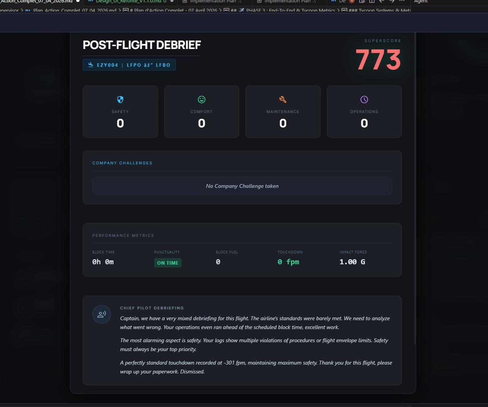
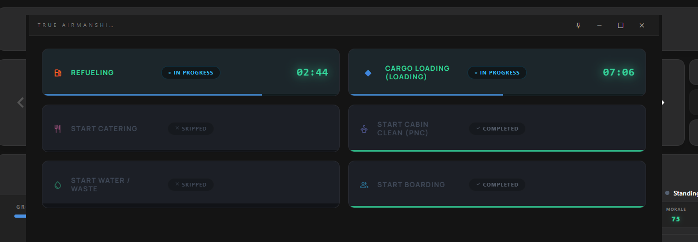
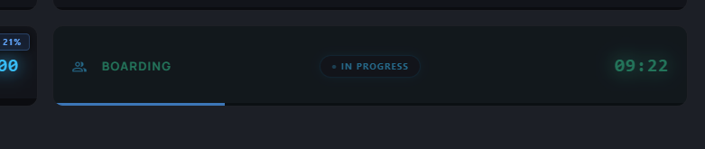
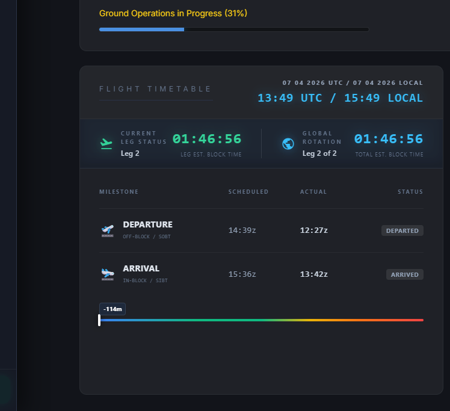

# Plan d'Action Complet - 07 Avril 2026

Voici l'ensemble des tâches restantes, réorganisées et renumérotées suite aux tests de validation.

## 🛠️ PHASE 1 : Fixes d'Interface & Horloges

- `[x]` **Bug 1 (ex-Bug 2 & 3):** Horloges et Date. L'heure UTC est affichée en double au lieu du Local Time, la date (jj/mm/aaaa) a disparu. Refaire la logique de l'offset Local/UTC basée sur les données MSFS.
- `[x]` **Bug 2 (ex-Bug 12):** Fix de l'inversion de l'affichage textuel "Avance / Retard" (Early vs Delayed) à la fin du vol.
- `[x]` **Bug 3 (ex-Bug 13):** Animation de Deboarding buguée dans le "Manifest" UI (les pax stagnent au lieu de descendre à zéro).
- `[x]` **Regression:** La date UI manquante (`--/--/----`) a été restaurée via l'ajout de `date` et `localDate` dans la boucle de payload `simTime`.
- `[x]` **Bug 11:** Glitch d'encodage UTF-8 sur le symbole de température Cabine ("°C" s'affiche au lieu de "°C") et valeurs potentiellement délirantes affichées (ex: 48.7).
- `[x]` **Bug 13:** Débordement textuel des boutons Ground Ops (`truncate` retiré et police ajustée pour permettre le retour à la ligne complet des mots sans les tronquer).
- `[x]` **Bug 14:** Le nom du "Captain" dans la page "Manifest" doit être celui qui est renseigné dans le profil du joueur
- `[x]` **Bug 16:** Vérifier que la fonction "TIme Skip" dans "Ground operations" fonctionne correctement. QUand je clique sur +5 mins il en skip beaucoup plus. Faire plutôt des boutons +1min +5min, +10mins
- `[x]` **Bug 17:** J'ai eu un ce message :
    15:01:56[PNC INT]Captain, it's getting really hot back here, passengers are complaining. Can you adjust the temperature? Alors que la température est de 24°C. Vérifier les limites d'alertes et la logique de déclenchement. 24°C c'est la température idéale. Bien vérifier que APU BLEED est bien sur marche pour que le monitoring commence. J'ai remarqué que le fait de bouger les knobs suffisaient à incrémenter la mesure de la température de notre côté. Alors qu'en fait tant que l'APU BLEED n'est pas en marche la température ne bouge pas.
- `[ ]` **Bug 18:** Presque toutes les métriques du vol sont débranchées pour le rapport. Je n'ai pas eu du tout les données d'aterrissage.

- `[ ]` **Bug 19:** Le deboarding se comporte comme le boarding alors que c'est l'inverse. On devrait partir de 164/164 et descendre à 0/164 avec le visuel correspondant de la cabine pleine qui se vide.

- `[ ]` **Bug 20:** Lié au bug 19 j'ai l'impression que d'avoir cliqué sur "Deboard' ça a en fait recommencer la phase "Boarding" de la leg1. La leg 2 est bien affichée dans le dashboard

- `[ ]` **Bug 21:** Il me semble qu'il ya des incoherences dans les données affichées. Je n'arrive pas à comprendre où et quand je me trouve par rappport aux legs.

- `[x]` **Bug 22:** Après le ménage, l'état de la cabine est plus sale qu'avant. (Correction string "Cabin Cleaning").

## ⚙️ PHASE 2 : Logique Backend & Core Mechanics

### Refonte Core & Moteurs
- `[x]` **Bug 19:** Transition Phases bloquée sur le Leg 2 (Réinitialisation manquante des flags `hasPassed10k`, `isAtCruise`, etc.).
- `[x]` **Bug 4 (ex-Bug 17):** Correction du décompte irrégulier Ground Ops (passer du `setInterval` au Timestamp absolu backend vs time target).
- `[x]` **Bug 5 (ex-Bug 8):** Synchro des Passagers Boarding vs SimBrief (probablement lié et à résoudre avec le Bug 4).
- `[x]` **Bug 6 (Réouvert suite Test):** Température Cabine erronée (ex: 48.7°C). Les LVARs lus (`S_OH_PNEUMATIC_FWD_TEMP`) correspondent à la position des molettes et non aux sondes réelles. Il faut trouver et récupérer indépendamment la valeur lue par le Fenix (cond page: 17/18°C) sans se soucier des réglages AC/Bleed dans un premier temps. Aussi, vérifier si le 48.7 ne viendrait pas d'une Ambient Temp de MSFS captée en Fahrenheit (48.7°F = 9.3°C).
- `[x]` **Crash Phase Update (07/04):** Impossible d'utiliser `innerText` of null lors de la réception de `payload.aobtUnix`. Fixé dans `app.js` en utilisant les identifiants corrects `ttActDep` et `ttActArr`.

### Game Logic Ground Ops
- `[x]` **Bug 7 (ex-Bug 11):** Propreté plafonnée (65%) et problème de calculs des rations du Catering (restrictions erronées).
- `[x]` **Bug 10:** Désynchronisation Passagers Boarding en mode Automatique (Le visuel Manifest ne se lance pas alors que le chrono Ground Ops Boarding se termine).
- `[x]` **Bug 12 (Regression):** Les passagers ne "prennent pas vie" après le 1er vol (leur état reste inerte après l'embarquement, car le code omettait la phase Turnaround pour la logique de Boarding et d'Anxiété).
- `[x]` **Crash sur bouton "SKIP" :** Erreur JS fatale (`Cannot read properties of null (reading 'style')`) car la modale de confirmation d'abandon a été supprimée des vues lors du précédent redesign, mais le bouton l'invoquait encore.
- `[x]` **Regression 2nd Leg:** Les passagers manquaient visuellement dans le manifest du Leg 2 (144 / 161) et n'étaient jamais déclarés "Boarded" : le backend créait bien le nouveau manifest mais oubliait de l'envoyer au frontend (`LoadNextLeg()`), désynchronisant le `PassengerManifest`.
- `[ ]` **Feature Séquençage :** Mettre en place le chaînage semi-automatique des Ground Ops par Phases dépendant du profil de la Compagnie.
- `[ ]` **Feature Étalonnage :** Vérifier et calibrer les temps de durée théorique des Ground Ops par rapport aux manuels FCOM de références.

---

## ✈️ PHASE 3 : End-To-End & Tycoon Metrics

### Passagers & Equipage
- `[ ]` **Bug 15 (Nouveau 07/04):** PA "Welcome Aboard" bloqué. Le bouton reste grisé avec "(EMBARQUEMENT REQUIS)" après l'embarquement. Il se débloque uniquement lors du "Taxi Out" alors qu'il devrait être disponible dès la phase "Pushback".
- `[ ]` **Bug 8 (ex-Bug 6):** Comportement des Ceintures à l'embarquement (remédier au 100% obéissance immédiate et ramener le concept de délai/retard/rébellion PNC au sol).
- `[ ]` **Bug 9 (ex-Bug 10 & Audit Triangle) :** Résolution des pénalités inactives (Anxiété, Confort). Validation complète du triplet: Politique Compagnie (Low Cost vs Legacy) - Variables de l'Aéroport - Note d'efficacité unique des PNC.
- `[ ]` ** Revoir complêtement les logique de ressenti des passagers (Anxiété, Confort) et les pénalités associées.

### Tycoon Systems & Metagame
- `[ ]` **Refonte Systèmes de Communication :** Implémentation de la refonte des communications avec le Flight Deck et les PNC (voir les documents Design_Gameplay générés).

### Tuning & Équilibrage
- `[x]` **Bug/Tuning (Retard) :** La satisfaction des passagers chute de manière disproportionnée. *Résolu : La perte de satisfaction n'utilisait pas le `deltaTime` et se déclenchait par frame, et les boutons de retard du Drill-Down n'étaient pas correctement bindés côté C#.*

---

## ⚠️ RÈGLES D'OR & INTERDITS
- Consulter le document **[Design_Technical_ACARS_Hoppie.md](d:/FlightSupervisor/docs/Design_Technical_ACARS_Hoppie.md)** avant toute idée de modification touchant à l'intégration ACARS du vaisseau.
